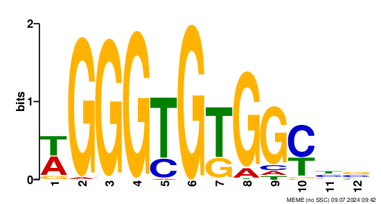

## [GitHub Classroom Assignment](https://classroom.github.com/a/poR--rLb)

## Data

You've been given some data from a reanalysis of the paper [Genome-wide maps of chromatin state in pluripotent and lineage-committed cells](https://www.nature.com/articles/nature06008) using the nf-core/chipseq pipeline.

You've also been given a file containing the MysteryFactorX regions.

- [nf-core/chipseq results for Data from Mikkelsen 2007](https://huggingface.co/datasets/funlab/mikkelsen_2007)
- [MysteryFactorX Regions](https://huggingface.co/datasets/funlab/applied-genomics/resolve/main/chipseq/MysteryFactorX_ChIPseq_mm10.bed)

## Instructions

### [IGV](https://igv.org/app/)

1. Visualize the regions in [IGV](https://igv.org/app/).
2. Combine the MysteryFactorX Regions with Peaks for H3K4me3 and H3K27me3 from Mikkelsen '07. Reproduce [Figure 1](https://www.nature.com/articles/nature06008/figures/1) (without the ChIP-chip data) to the best of your ability using IGV, including the MysteryFactorX.


Figure 1

### [MEME-ChIP](https://meme-suite.org/meme/doc/meme-chip.html?man_type=web)

3. Perform motif analysis on the MysteryFactorX Regions. Add a image of the motif to your README.
4. What TF might the MysteryFactorX be?

Example motif logo:



### [Bedtools](https://bedtools.readthedocs.io/en/latest/index.html)

5. How many MysteryFactorX regions overlap with H3K4me3 peaks?
6. How many MysteryFactorX regions overlap with H3K27me3 peaks?

Feel free to use [igv-notebook](https://github.com/igvteam/igv-notebook), the [IGV web app](https://igv.org/app/), or the [IGV desktop application](https://igv.org/doc/desktop)! [igv-reports](https://github.com/igvteam/igv-reports) will also work!

You may write a bash script, Jupyter Notebook, Snakemake, Galaxy or a combination of all of them. Just document how to reproduce your analysis!

## Useful Docs

- [nf-core/chipseq 2.0.0](https://nf-co.re/chipseq/2.0.0)
- [Biostar Handbook: Using the Integrative Genomics Viewer](https://www.biostarhandbook.com/using-the-integrative-genomics-viewer.html) Chapter 41 - Page 367
- [Biostar Handbook: Chip-Seq motifs](https://www.biostarhandbook.com/chip-seq-motifs.html) Chapter 114 - Page 922
- [Biostar Handbook: Downstream Analysis 1](https://www.biostarhandbook.com/chip-seq-downstream-analysis-1.html) Chapter 116 - Page 949

:::tip
`-meme-maxw` and `-meme-minw` have been replaced by`-maxw` and `-minw`
:::

<!-- TODO Make this folded -->

## Hints

- Search a Gene name that's in the center of the figure to get the location of Figure 1
- Read the Figure description to get the size of the window used in IGV

<details>
<summary>Running MEME-ChIP on chr1 only</summary>

```bash
wget https://hgdownload.cse.ucsc.edu/goldenPath/mm10/chromosomes/chr1.fa.gz
gunzip chr1.fa.gz
samtools faidx chr1.fa
wget https://huggingface.co/datasets/funlab/applied-genomics/resolve/main/chipseq/MysteryFactorX_ChIPseq_mm10.bed
sed -i '/^chr1\s/!d' MysteryFactorX_ChIPseq_mm10.bed
bedtools slop -g chr1.fa.fai -i MysteryFactorX_ChIPseq_mm10.bed -b 50 > extended.bed
bedtools getfasta -bed extended.bed -fi chr1.fa -fo sequences.fa
```

</details>
